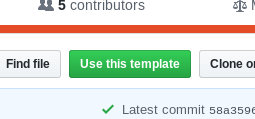
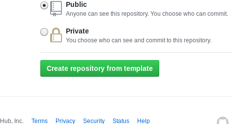

# Preserve This Podcast

## About
This is the codebase for [preservethispodcast.org](http://preservethispodcast.org/), the Preserve This Podcast (PTP) website for the [Andrew W. Mellon grant-funded project](https://mellon.org/grants/grants-database/grants/new-york-metropolitan-reference-research-library-agency/1711-05080/). This site is built using [Jekyll](https://jekyllrb.com/), a static site generator, and hosted on [GitHub Pages](https://pages.github.com/). 

Below are instructions on how to copy this website and how to host your own podcast RSS feed within the web browser. There is a command line option for those who are more comfortable for Git but this guide is for those who like graphical user interfaces (GUIs). This setup has been tested in Jekyll with GitHub Pages only. Feel free to test this on other Git hosting platforms (e.g. GitLab or Bitbucket), and any other static site generator (e.g. Nikola, Hugo). Then let us know how it goes!

Maintainer: [@michi-gato](https://github.com/michi-gato)

The straightforward way to get your podcast website + RSS feed started is to copy this podcast-template repository and then customize your version from there. 
1. Create a GitHub account and log into your account
2. Navigate to PTP template repository: [michi-gato/podcast-template](https://github.com/mnylc/preservethispodcast)
3. Click on the green “Use this template” button in the top right corner of the main page. This will create your own repository of the PTP website and RSS feed without touching the existing PTP site build. Here are step-by-step instructions on how to create a repository from a template. (From here on out, let’s call the back end editing view, the repository, and the website will be the front end view).

4. You will be redirected to a page where you’ll create your URL (repository name). Make sure to make this public so that podcatchers can find your RSS feed.
5. Click the green button, “Create repository from template”

6. You’ll be redirected to the main back end editing page of your repository. Now it’s time to customize/manage your website. 
7. If you already have a website, skip to Step 8. For those who want to build out your own show/organization website, here are some helpful introductory resources on how GitHub Pages works. You can customize this site to reflect your own website through  the files that correspond to specific sections/pages of the site. Our own website was built following these types of 
   * [Creating and Hosting a Personal Site on GitHub](http://jmcglone.com/guides/github-pages/) by Jonathan McGlone
   * [GitHub Pages](https://pages.github.com/) official site
   * [How to effortlessly create a website for free with GitHub Pages (even if you don’t know what you’re doing)](https://towardsdatascience.com/how-to-create-a-free-github-pages-website-53743d7524e1) by Anne Bonner
   * [Liquid template](https://shopify.github.io/liquid/) for design
   * [CSS documentation](https://bulma.io/documentation/)
8. Delete all of the Preserve This Podcast copy and replace the text and images with your own brand and copy. You can customize website pages by updating these files:
   * _data / content.yml controls text and links displayed on the homepage/front end, including:
      * Google Analytics
      * URLs for buttons throughout the sections of the website
      * URLs to subscribe to each podcatchers
      * Individual episode title
      * URL to RSS streaming and downloadable audio from podcast hosting platform
      * URL to each exercise in zine page corresponding to each episode
      * URL to each episode transcript
      * Metadata to upcoming events
      * Metadata to past events
   * _episodes includes individual markdown files per episode. This will hold metadata for the RSS feed to loop through. Each episode will have its own markdown file. Each of these fields need to have valid metadata in order to be accepted into Apple Podcasts, as of September 2019:
      * `layout: post` (this will always be “post”)
      * `title:` (the value must be in quotations)
      * `file:` (this is the URL to the MP3 file from Internet Archive. [Directions on getting mp3 file URL] (https://turbofuture.com/internet/How-to-Host-Podcast-Audio-on-Archiveorg))
      * `file_itunes:` (this is the URL to the MP3 file that will be sent to Apple Podcasts)
      * `excerpt:` (this is the show notes)
      * `summary` (show notes again)
      * `duration` (audio length in minutes within quotations)
      * `length` (file size in bytes within quotations)
      * `explicit` (yes or no within quotations if there is explicit language)
      * `block` (yes or no within quotations if you’d like to display the podcast in itunes)
      * `categories:` (the value will always be “episodes” but not within quotations)
   * _includes / footer.html controls the text that appears at the footer of the website. In this case, this credited our sponsors, website developer, and the Creative Commons license that identifies what rights people have when using our podcast, accompanying text/images, etc. 
   * _includes / header.html controls the title and URLs for the header navigation bar/menu.
   * assets / images all image files you want to appear on the website will live in this folder. E.g. logos. Make sure you have a logo that matches Apple’s size and dpi!
   * pages / 404tba.html controls the 404 error page that visitors see when something is broken. Customize it to your style 
   * pages / about.html controls the About page. Shout-out to all the players and creators.
   * transcripts : this folder will hold each episode transcript 
   * transcripts / trancript01-time-to-take-notice.md this is the individual episode trancript. Be sure to write this in markdown and to settle on a standard and orderly naming convention for the consecutive transcript files.
   * README this will be displayed on the bottom of your main repository page. This is standard good practice for any software or codebase. Generally, this should include text about your project, how the code works, and other useful things you want the vast world of internet users to know about.
   * _config.yml holds the website builder, Jekyll Configurations. You’ll need to personalize the website by adding your `title`, `description`, `url`. Keep `baseurl` as just the quotes.
      * The only other section you need to worry about is the `# Podcast Feed settings`. Those fields will feed to podcatchers.
   * Index.html this will be important to you if you are building out your website. At the very least, you should update the HTML to be relevant to your show. Check out step 7 source links for more info on how to customize your website.
   * podcast.rss this is the bread and butter of your podcast show. Go through the XML code and find places where you can customize it to your show. For example:
      * Line 30: `<itunes:image href="{{ site.url }}/assets/images/PTP_logo_itunes.png" />` Swap in the png file name of your logo image file
      * Lines 31-36: insert your own categories that match Apple’s vocabulary As of Aug. 2019, here are the [available categories](https://9to5mac.com/2019/08/01/apple-podcasts-categories/).
      * Line 52: `<itunes:image href="{{ site.url }}/assets/images/PTP_logo_itunes.png" />` Again, swap in the png file name of your logo image file

Don’t forget to
   * test your RSS before submitting to podcatchers : [Podbase](https://podba.se/validate/)
   * submit your new RSS to your original podcast hosting platform for a 301 Redirect so that you don’t lose listeners!

Thank you to these awesome articles that guided us on making our own RSS feed:
   * [How to Host Podcast MP3 on Archive.org](https://9to5mac.com/2019/08/01/apple-podcasts-categories/)
   * [Podcasting with Jekyll in 4 Steps](https://dyscribe.com/en/podcasting/podcasting-with-jekyll-in-4-steps.html)
   * [RSS Feeds and Jekyll Configuring RSS Feed and implementing into Jekyll](https://www.johnvincent.io/jekyll/rss-feed-with-jekyll/)
